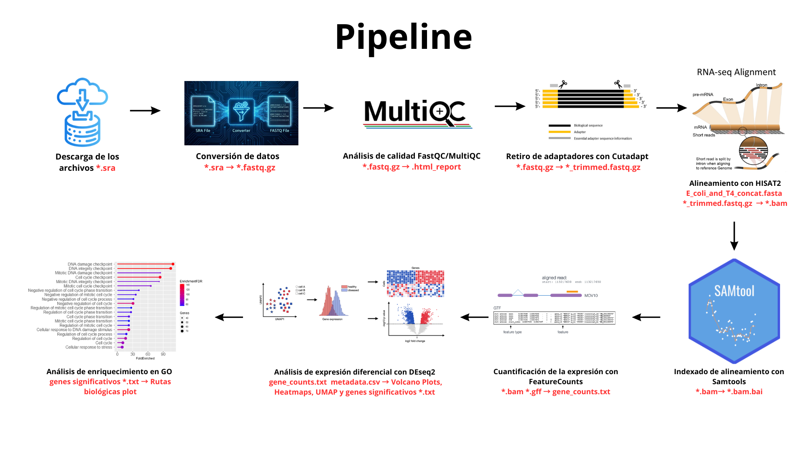

# rnaseq_infection

Análisis de cambios en la expresión génica de *Escherichia coli* durante la infección por el bacteriófago T4.

---

## Pipeline del análisis



---

## Estructura del repositorio

```
src/ <- scripts y logs del análisis

plots/ <- volcano plots, heatmaps, GO terms, PCA and UMAPs.

gene_list/ <-listas de genes diferencialmente expresados por comparación
```

---

## Datos utilizados

Los datos de RNA-seq provienen del BioProject ***PRJNA868713***, depositado en GEO bajo la accesión ***GSE211026***.

El organismo de estudio es *Escherichia coli*, por lo que no aplica clasificación por tejido o tipo celular.

Este conjunto de datos fue generado por Wolfram-Schauerte et al. (2022) en el estudio:

*Omics Reveal Time-Resolved Insights into T4 Phage Infection of E. coli on Proteome and Transcriptome Levels.*

Se compararon bacterias de *Escherichia coli* no infectadas vs bacterias infectadas con bacteriófago T4 en distintos tiempos post-infección.

### Control
- Sin infección (3 réplicas biológicas)

### Tratamientos
- 1 minuto post-infección (3 réplicas biológicas)
- 4 minutos post-infección (3 réplicas biológicas)
- 7 minutos post-infección (3 réplicas biológicas)
- 20 minutos post-infección (3 réplicas biológicas)

---

## Pipeline bioinformático

Las herramientas utilizadas fueron:

- FastQC: control de calidad de lecturas
- MultiQC: resumen de calidad
- Cutadapt: eliminación de adaptadores
- HISAT2: alineamiento contra el genoma de referencia
- Samtools: manipulación de archivos BAM
- featureCounts: cuantificación de lecturas por gen

---

## Análisis downstream

- Análisis de expresión diferencial 
- Enriquecimiento funcional (GO terms)
- Visualización de resultados:
  - Volcano plots
  - Heatmaps
  - PCA
  - UMAP

---

## Resultados

- Listas de genes diferencialmente expresados por condición (gene_list/)
- Figuras exploratorias y finales (plots/)
- Matrices de conteo procesadas
- Scripts usados en el pipeline en src/
  
---

## Referencias

- Wolfram-Schauerte et al. (2022)
- BioProject PRJNA868713 (NCBI)
- GEO accession GSE211026

---

